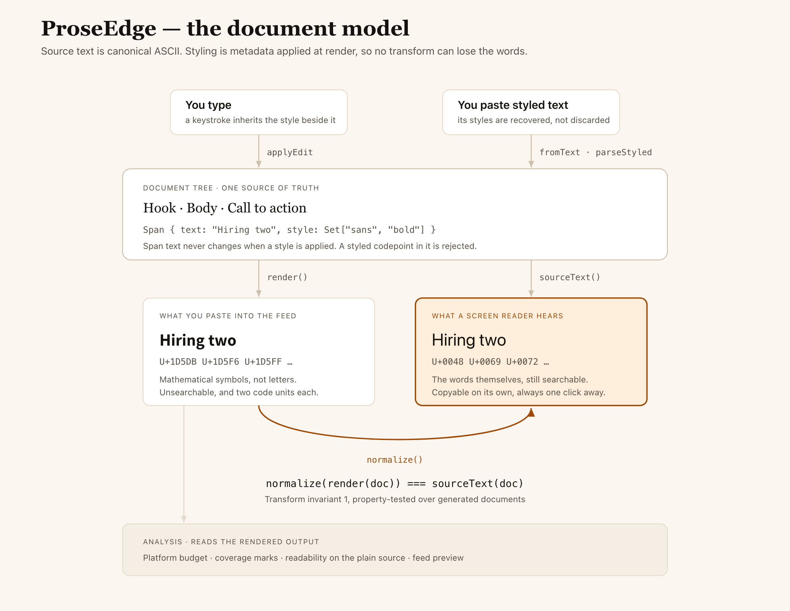

# ProseEdge

[](https://github.com/GgauravJ05/ProseEdge/actions/workflows/ci.yml)
[](LICENSE)

A local-first editor for social posts that use Unicode "bold" and "italic"
letters, which measures what that styling costs screen-reader users. It scores
openings with a compressed ranking model that runs entirely in the browser.

**Try it: <https://proseedge.vercel.app>**

> **Status: v0.1 formatter.** The editor styles text in serif, sans, script,
> fraktur, double-struck and monospace — with bold and italic where Unicode has
> them — plus underline and strikethrough as combining marks, and uppercase and
> lowercase as transforms. It copies styled or plain text, offers the whole post
> in every style at once, counts against the limit of the platform you are
> writing for, flags characters a font cannot style, and keeps the draft in the
> browser. The accessibility study and the ranking model are in progress, and no
> performance or quality numbers are claimed. See the
> [build order](docs/architecture-spec.md#11-build-order).

## Why

LinkedIn, X and Threads have no rich text, so authors substitute Mathematical
Alphanumeric Symbols (`𝗕𝗼𝗹𝗱`) for letters. Screen readers read those as
"mathematical sans-serif bold capital B" or skip them. ProseEdge keeps the plain
text as the source of truth, so styling is always reversible, and it reports
exactly which characters could not be styled rather than silently substituting
lookalikes.

## Architecture

<picture>
  <source media="(prefers-color-scheme: dark)" srcset="docs/screenshots/architecture-dark.png">
  
</picture>

Source text stays canonical ASCII and styling is metadata applied at render, so
`normalize(render(doc)) === sourceText(doc)` holds for every document and every
style combination — property-tested over generated documents, not asserted. That
round trip is what makes the plain-text pane truthful and every transform
reversible.

[`docs/architecture.html`](docs/architecture.html) is the standalone version: one
file, no build step, and it follows your light or dark setting.

## Documentation

- [Roadmap: the formatter ships first, research features follow](docs/roadmap.md)
- [Technical specification and research plan](docs/architecture-spec.md)
- [The document model, as a diagram](docs/architecture.html)
- [Architecture decision records](docs/adr/)
- [Contributing](CONTRIBUTING.md)

## Development

```sh
corepack enable && pnpm install && pnpm check
```

## License

[AGPL-3.0-or-later](LICENSE)
